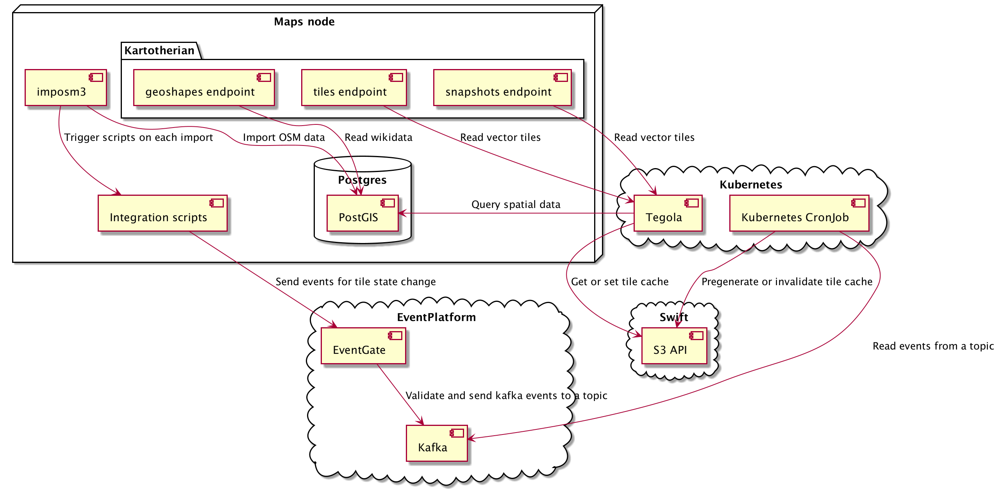
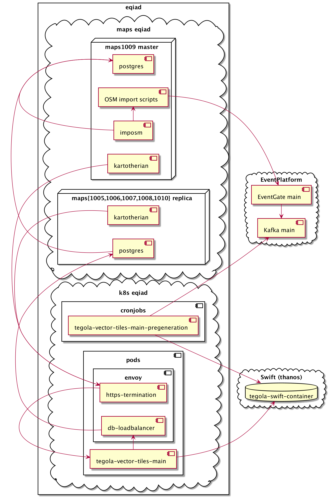
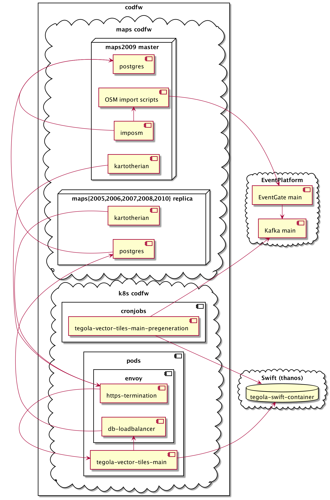

# Maps v2
## Architecture
For more information about the Maps v2 architecture, please refer to the [wiki page at Wikitech](https://wikitech.wikimedia.org/wiki/Maps/v2/Architecture).

## Infrastructure
For more information about the Maps v2 deployment, please refer to the [wiki page at Wikitech](https://wikitech.wikimedia.org/wiki/Maps/v2/Infrastructure).
### Eqiad

### Codfw

