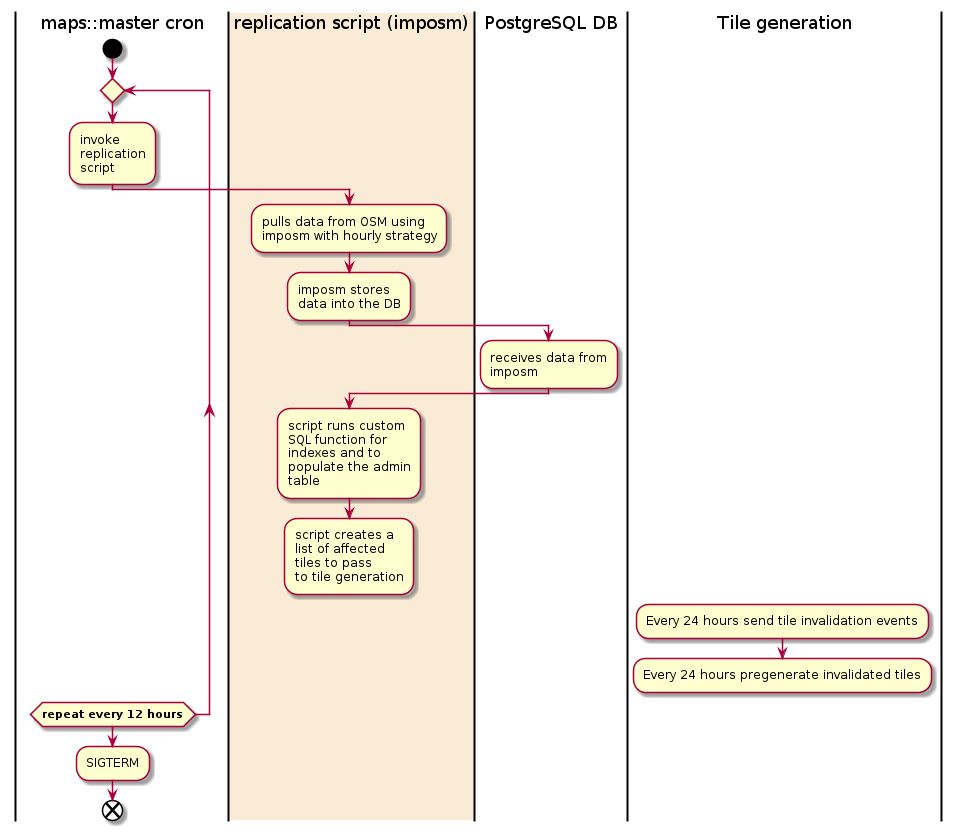
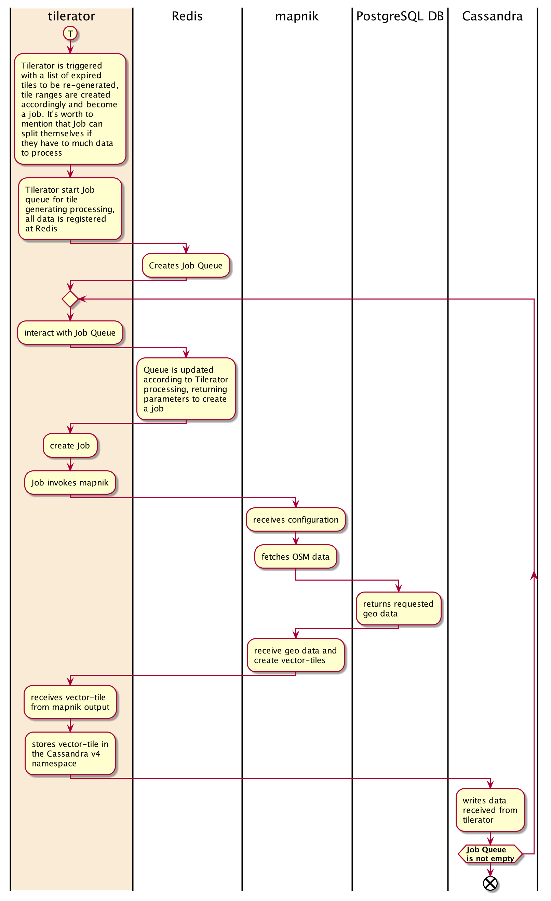
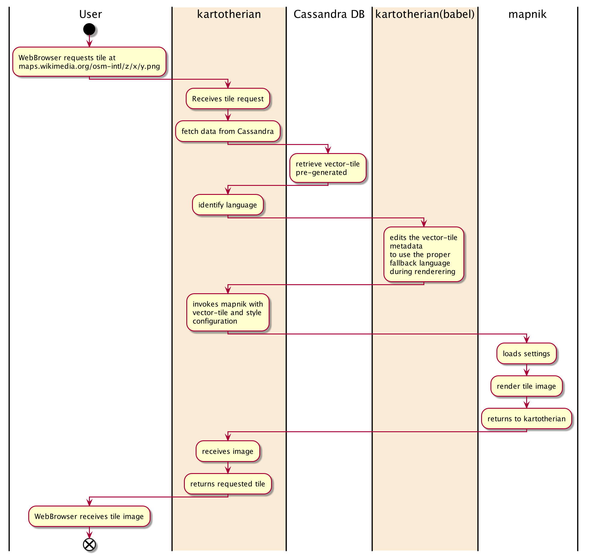
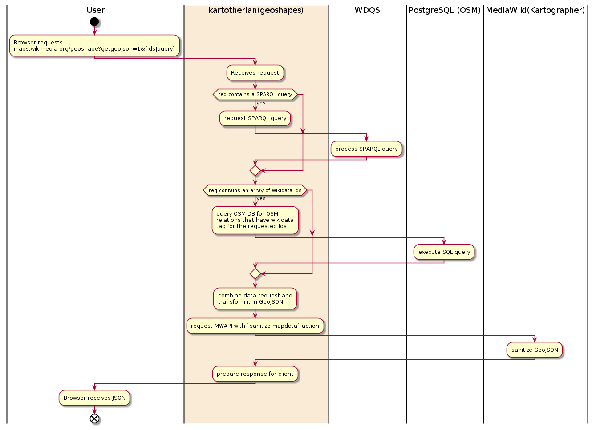
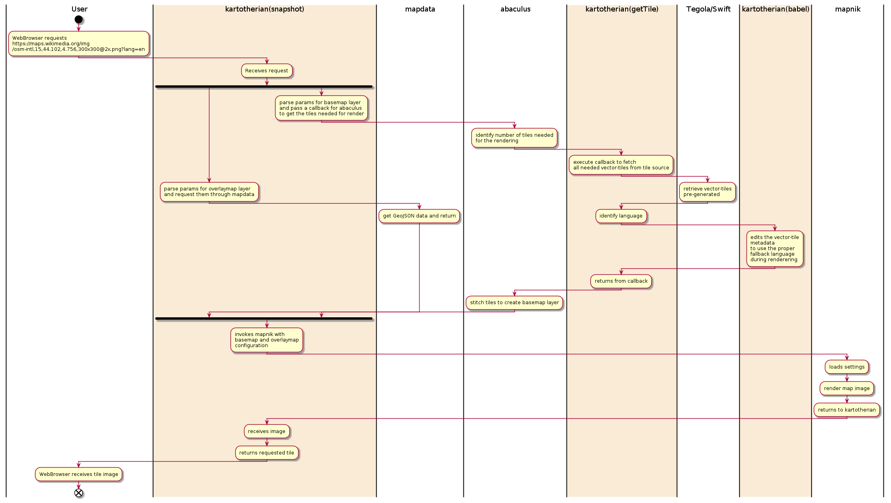

# Maps Data Flow

Kartotherian uses data from OSM database, from the OSM sync data until it's served, the data flow follow some specfic pipelines:

## Incoming
### OSM sync data flow

### Tile generation data flow

## Outgoing

### Tile server data flow

### Static Map request data flow

### geoshapes GeoJSON request data flow

