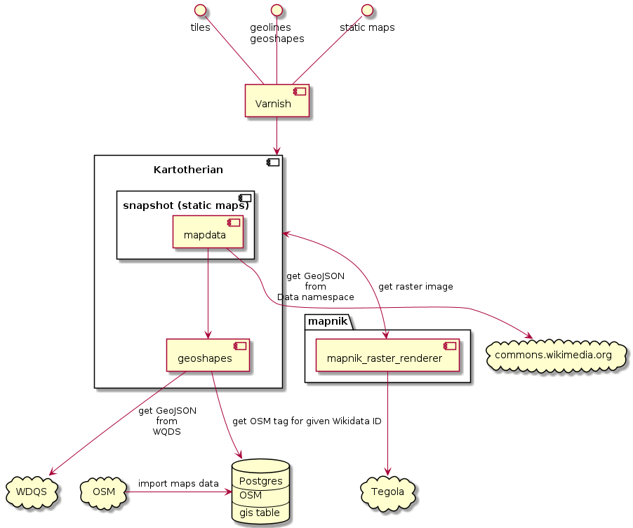
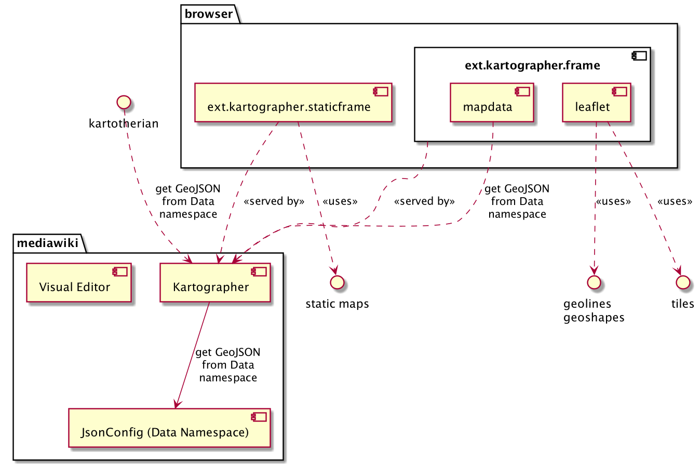
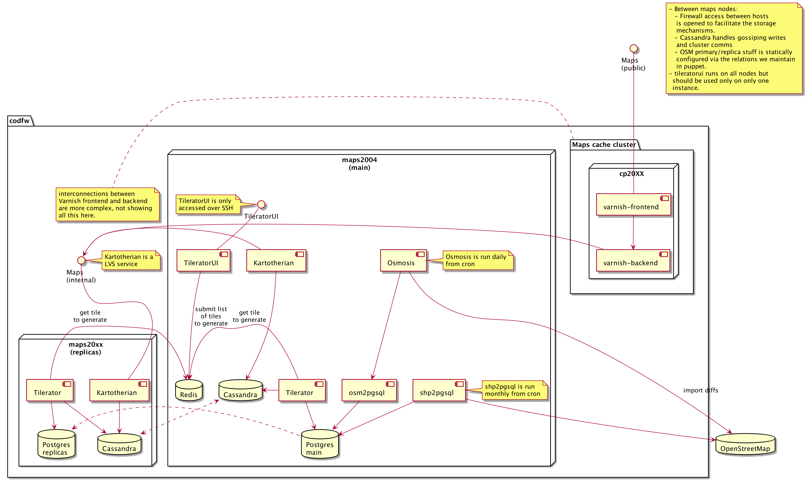

# Maps Infrastructure
The maps service consists of Kartotherian - a nodejs service to serve map tiles, Tilerator - a non-public service to prepare vector tiles (data blobs) from OSM database into Cassandra storage, and TileratorUI - an interface to manage Tilerator jobs. 
## Backend

## Frontend

## Deployment diagram

